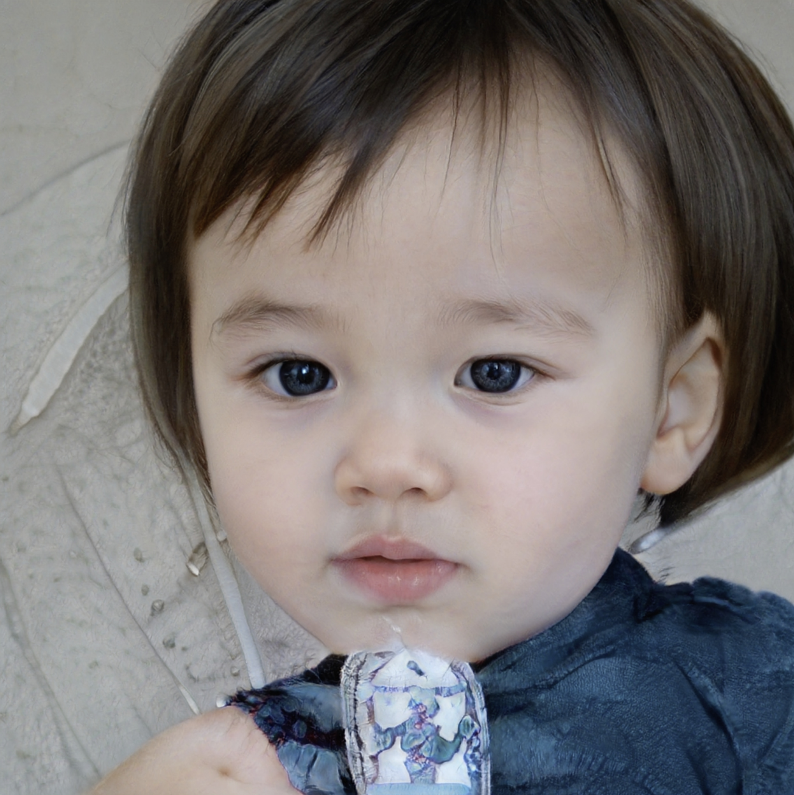

# Sky User Page
## About me.
### Quick Introduction.
Hi! I am a UCSD undergrade student majors in __Neuobiology__ and __Computer science__. My research focuses on microbiome & human interaction, and particularly in relationship to head and heck cancer. As a hobby I shoot short files and takes photos for others.
Here is [my favorite photo work](6.jpg). To learn more about me as a programmer, skip to [this section](#as-a-programmer)

### A picture of me.
  

(From
_thispersondoesnotexist.com_)

### Recent Projects.
- IBD Microbiome
>How gut micriobiome interaction linked to IBD diagonsis? 
- Covid-19 Disparity
>Racial & economical status' impact on Covid outcomes. 
- "Lure"
>A short film about a lost girl. Lighting design by me.

For more of my photography work, visite my [website](https://frabjous-malabi-69ad55.netlify.app/cinematography.html).

## As a Programmer.
### Ranking of My Favorite Programming Languages.
1. Python
2. C++ / C
3. JavaScript
4. Java
5. R / Matlab

This is my favorite python code snippet:
```
# Swaping varibles without temp
a, b = b, a
```
## Goal For This Class.
- [x] Register
- [ ] Group work in final project
- [ ] Finish with an A

## To Learn More About Me
Please visit [my website](https://frabjous-malabi-69ad55.netlify.app/index.html), a project from _CSE134_ taught by prof. Powell as well.

[Go back to top](#sky-user-page)